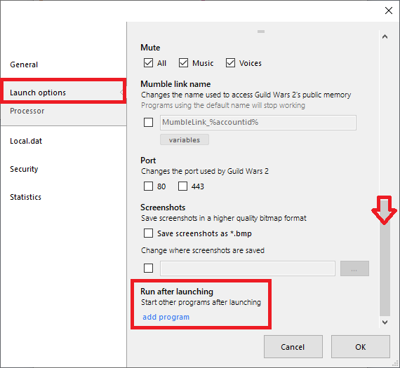
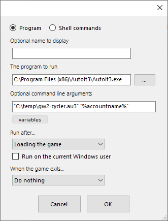

# GW2Launcher-AutoIT-logins

An AutoIT script to login and to multiple GW2 accounts, managed in [GW2Launcher](https://github.com/Healix/Gw2Launcher), in order to simply and easily collect daily rewards.

***IMPORTANT*** No warranty is provided as to the use of this software with Guild Wars 2, or any potential breach of the code of conduct, any actions taken are the responsibility of the account owner.

## Prerequisites

1. Install and set up [GW2Launcher](https://github.com/Healix/Gw2Launcher) for your accounts to the point that they can run when launched.
2. Install [AutoIT](https://www.autoitscript.com/site/) on your PC.

## Usage

1. Download the [scripts/gw2-cycler.au3](scripts/gw2-cycler.au3) file to your local computer.
2. In each account, add the option through **Launch Options > Run after launching > Add program**.

   

3. Add the following settings:
   - The program to run: Your AutoIT executable path (e.g. C:\Program Files (x86)\AutoIt3\AutoIt3.exe)
   - Optional command line arguments: "(*Path to the file*)\gw2-cycler.au3" "%accountname%"
   - Run after...: "Loading the game"

   

4. Click the account in GW2 Launcher to open the account.

## Executable

An executable is also available at [build/gw2-cycler.exe](build/gw2-cycler.exe). Set this up as per the image below.

   

## Notes

If you have a slower computer you many need to add additional time for the game to load. This can be edited in the loadtime variable.

When you want to open your account normally (e.g. to sell or transfer materials), move or rename script or disable it in GW2Launcher.

